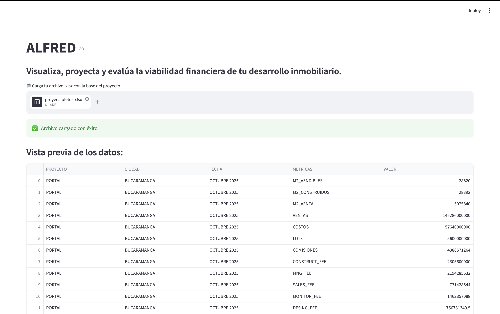
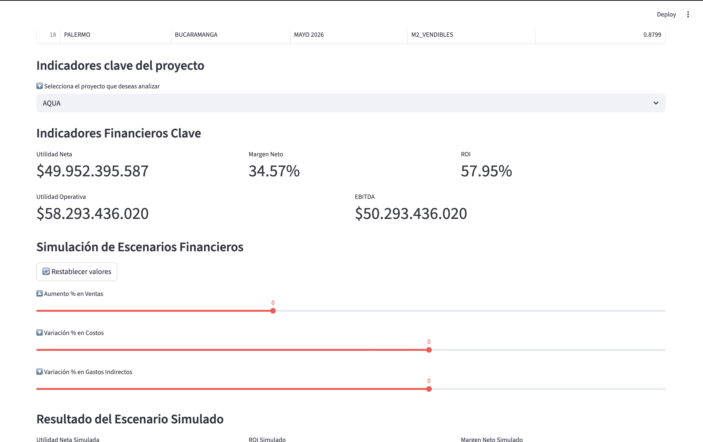
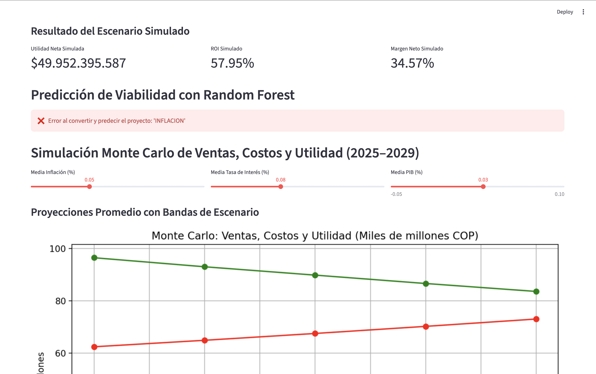
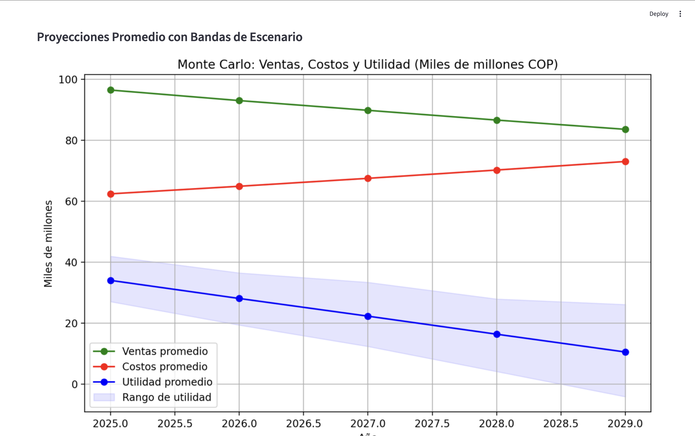
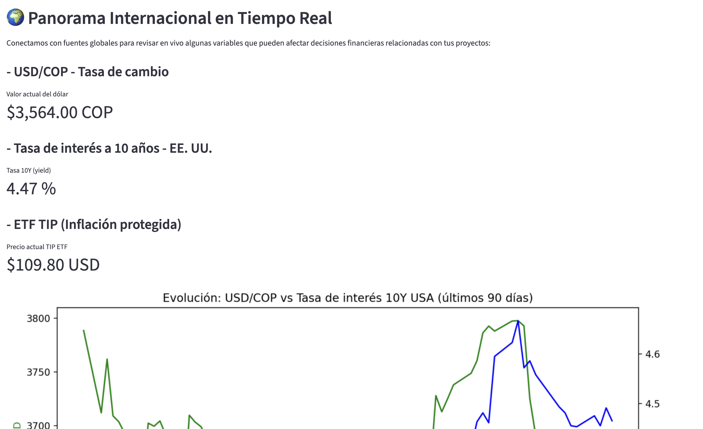

# ALFRED - Real Estate Financial Analysis Platform

An interactive Python-based application designed to analyze, project, and evaluate the financial viability of real estate development projects.

The tool allows users to upload project data via Excel files, process key real estate development indicators, and generate financial metrics to support investment decision-making.

This application is designed for the Colombian real estate market; therefore, the interface is in Spanish to align with local users, investors, and industry practices.

---

## Objective

To facilitate the financial analysis of housing and real estate development projects through an intuitive interface that enables:

- Uploading real estate project data.
- Visualizing and validating project information.
- Analyzing operational and financial indicators.
- Evaluating project profitability and feasibility.
- Supporting investment and financial structuring decisions.

---

## Technologies Used

- Python
- Streamlit
- Pandas
- NumPy
- Scikit-Learn
- OpenPyXL

---

## Features

### Data Upload
Users can upload Excel files containing project information.

### Data Exploration
Interactive visualization of variables such as:

- City
- Project
- Date
- Sellable square meters
- Built square meters
- Sales
- Costs
- Land value
- Commissions
- Construction fees
- Management fees

---

### Financial Analysis
The platform processes the input data and computes relevant indicators to assess the economic performance of the project.

---

### Interactive Interface

Built with Streamlit to ensure ease of use for investors, developers, and financial analysts.

---

## Interface Preview

### Home Screen
<p align="center">
  
</p>

---

### Dashboard Overview
<p align="center">
  
</p>

<p align="center">
  
</p>

<p align="center">
  
</p>

<p align="center">
  
</p>


---

## Project Structure

```text
.
├── app.py
├── requirements.txt
├── model_rf.pkl
├── scaler.pkl
├── README.md
└── images/
